# 簡介

歡迎使用胰探究竟後台交接手冊。**胰探究竟－章醫師的胰臟日常** 是章明珠醫師的個人醫學衛教部落格，訪客可透過 [https://pancreasblog.com](https://pancreasblog.com) 閱讀文章，編輯者則透過 [https://pancreasblog.com/admin](https://pancreasblog.com/admin) 管理內容。

本手冊分為兩大部分：

* **操作指南（第 1–4 章）**：給章醫師日常使用，說明如何發文、編輯頁面與管理圖片。
* **技術交接（第 5 章）**：給維護人員或交接對象，含系統架構、欄位對照與已知限制。

> **正式環境網址**
>
> * 前台：<https://pancreasblog.com>
> * 後台：<https://pancreasblog.com/admin>

# 開始使用

本節涵蓋前台網站概覽與後台登入的初始步驟。

## 前台網站概覽

訪客進入網站時，首先看到首頁 Hero 區塊，包含主標「看懂胰臟，從理解開始」與兩個行動按鈕（如圖 1 所示）。

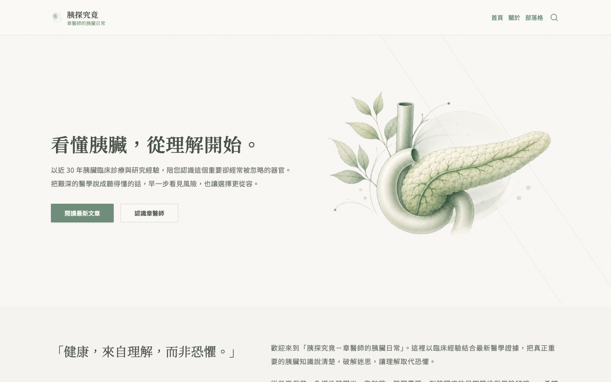

向下捲動可看到「四大特色」區塊，介紹近 30 年臨床經驗、完整疾病光譜、早期發現與理解而非恐懼（見圖 2）。

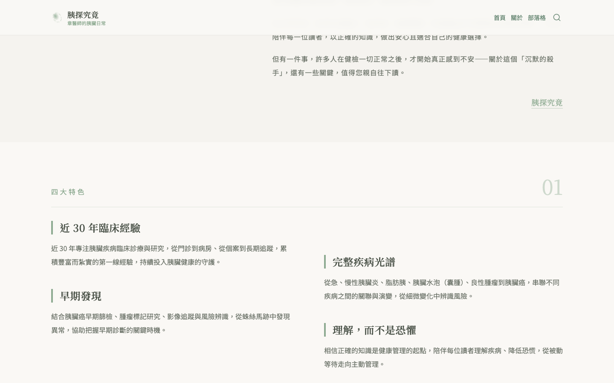

「依主題閱讀」區塊提供五個主題分類卡片：胰臟水泡、胰臟發炎、胰臟癌、胰臟癌篩檢、胰臟健康（如圖 3 所示）。

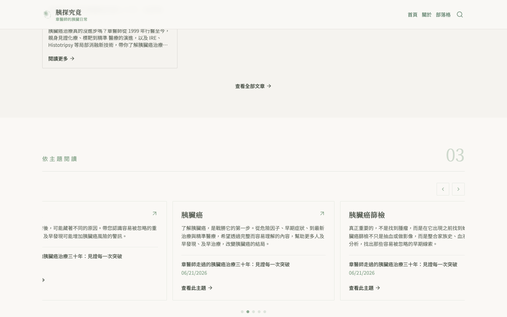

首頁底部有關於章醫師簡介與《攔截胰臟癌》書籍推廣區（見圖 4）。

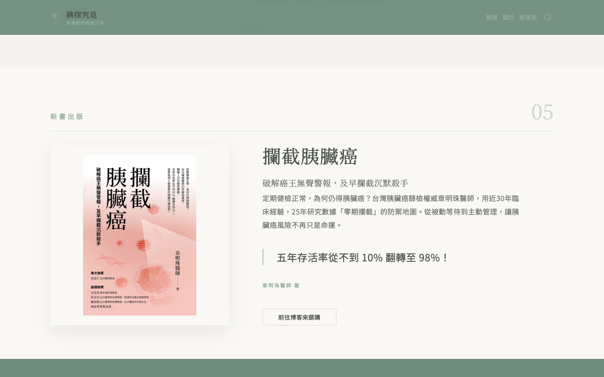

其他前台頁面包括：

* **關於頁**（`/about`）：完整介紹章醫師理念與專業經歷（見圖 5）。
* **文章列表**（`/posts`）：所有已發布文章以卡片形式列出（見圖 6）。
* **單篇文章**：含封面、內文、FAQ 與法遵聲明（見圖 7）。
* **搜尋功能**：點頂部搜尋按鈕，輸入關鍵字即時查找文章（見圖 8）。
* **法遵頁**（`/terms`）：著作權與醫療資訊聲明（見圖 11）。

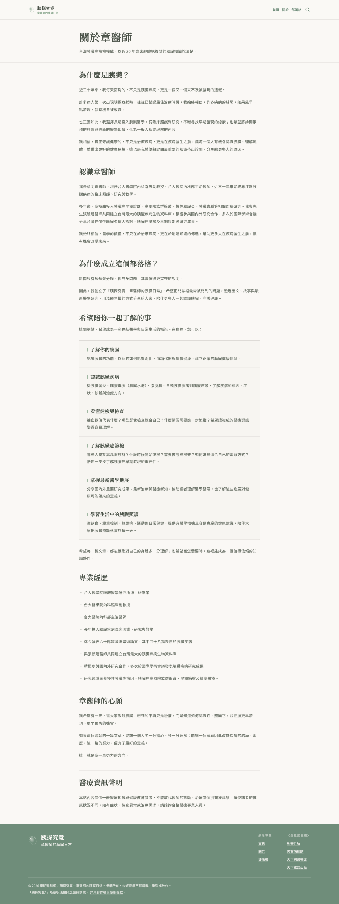

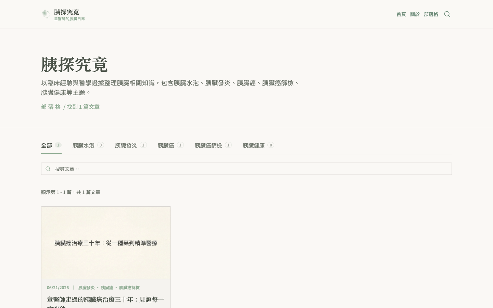

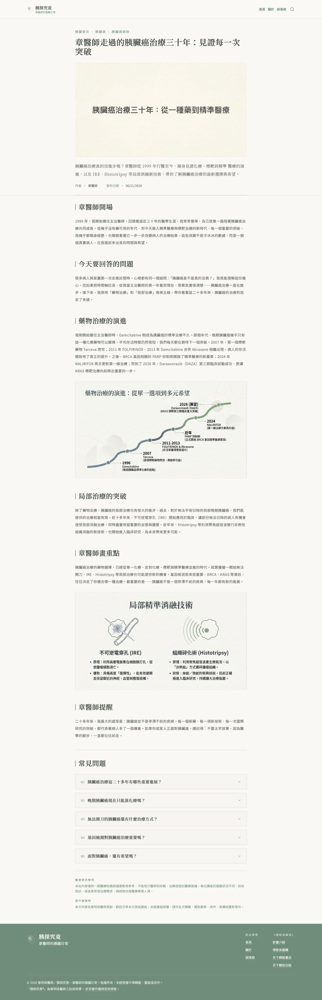

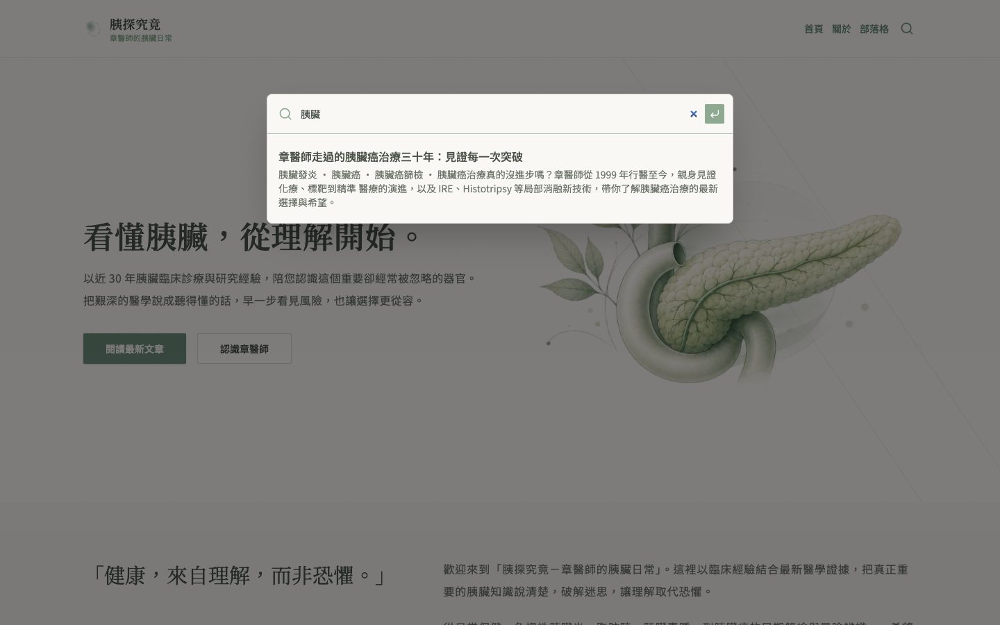

網站亦支援手機版瀏覽（見圖 9、圖 10）。

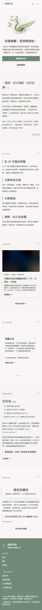

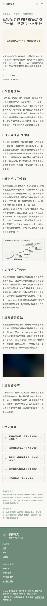

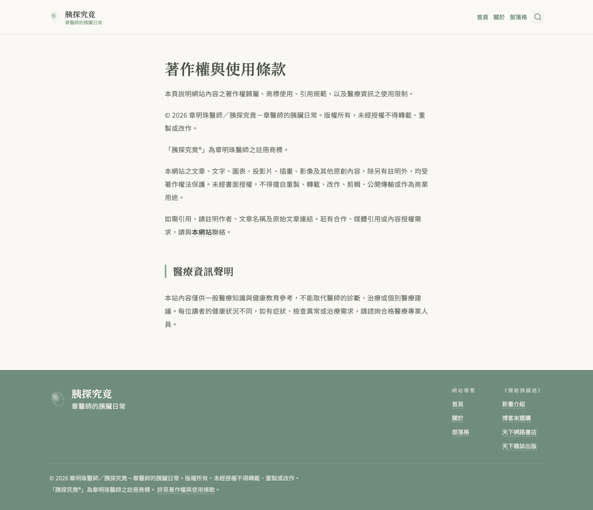

## 登入後台

1. 開啟瀏覽器，前往 **<https://pancreasblog.com/admin>**。
   * 您會看到 Payload CMS 登入畫面（如圖 12 所示）。

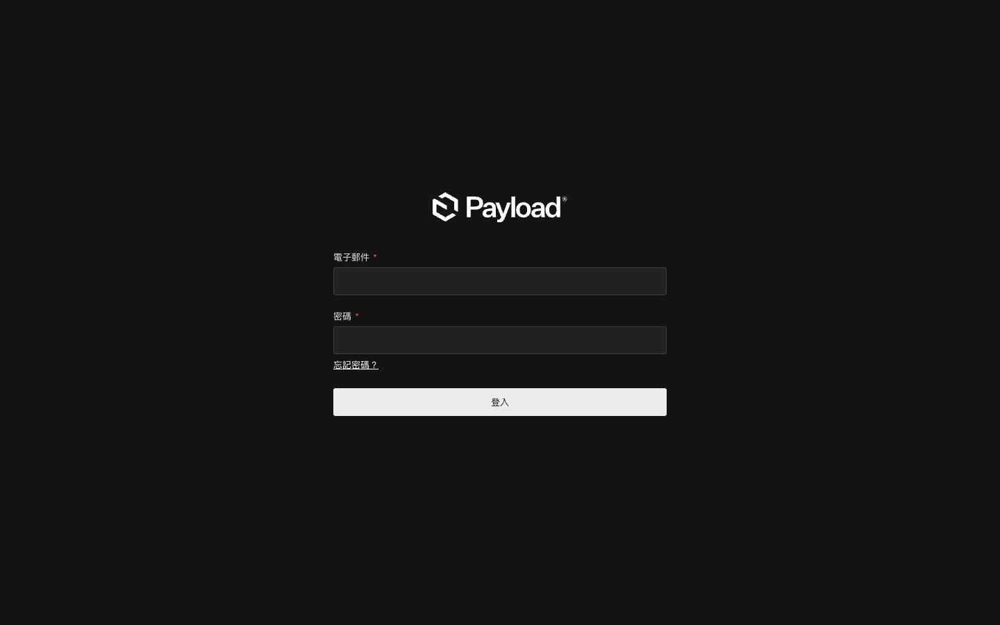

2. 輸入 Email 與密碼。
3. 點選「登入」。
   * 登入成功後，系統會導向後台儀表板（見圖 13）。

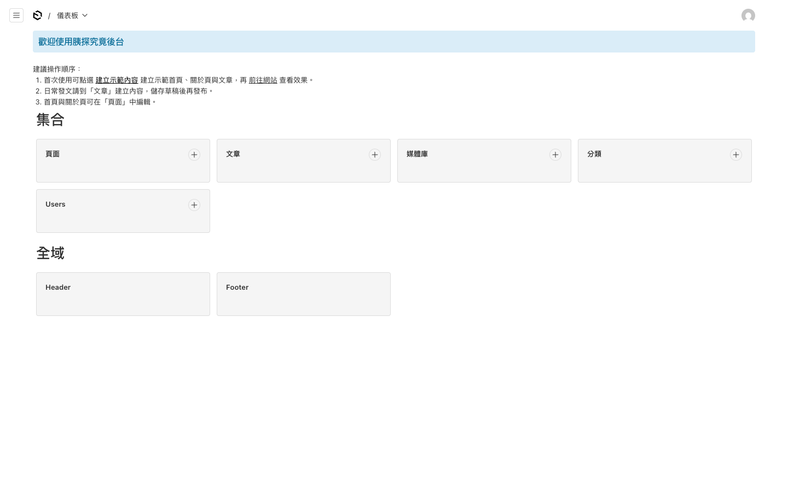

## 後台主要選單

登入後，左側選單提供以下功能：

| 選單 | 用途 |
|------|------|
| **文章** | 撰寫、編輯、發布部落格文章 |
| **頁面** | 編輯首頁、關於頁等固定頁面 |
| **分類** | 管理五個主題分類的名稱、說明與排序 |
| **媒體庫** | 管理已上傳的圖片 |
| **Header / Footer** | 調整頂部導覽列與頁尾連結 |

# 文章管理

本節說明如何建立、編輯與發布部落格文章。

## 發布新文章

建議流程：**撰寫 → 存草稿 → 預覽 → 發布**。

1. 左側選 **「文章」** → **「建立新項目」**。
2. 填寫 **標題**（必填）。
3. 填寫 **摘要**（必填，會顯示在文章標題下方）。
4. 切換至 **「內容」** 分頁，撰寫正文。
5. （選填）上傳 **封面圖**。
6. 切換至 **「其他」** 分頁，選擇 **分類**、設定 **FAQ**、填寫 **行銷素材**。
7. 切換至 **「SEO」** 分頁，確認搜尋引擎標題與描述（可使用「產生」按鈕）。
8. 點 **「儲存草稿」** 先保存。
9. 點 **「預覽」** 或 **Live Preview** 查看效果。
10. 確認無誤後，將狀態改為 **「已發布」**。

文章編輯介面如圖 14 所示。

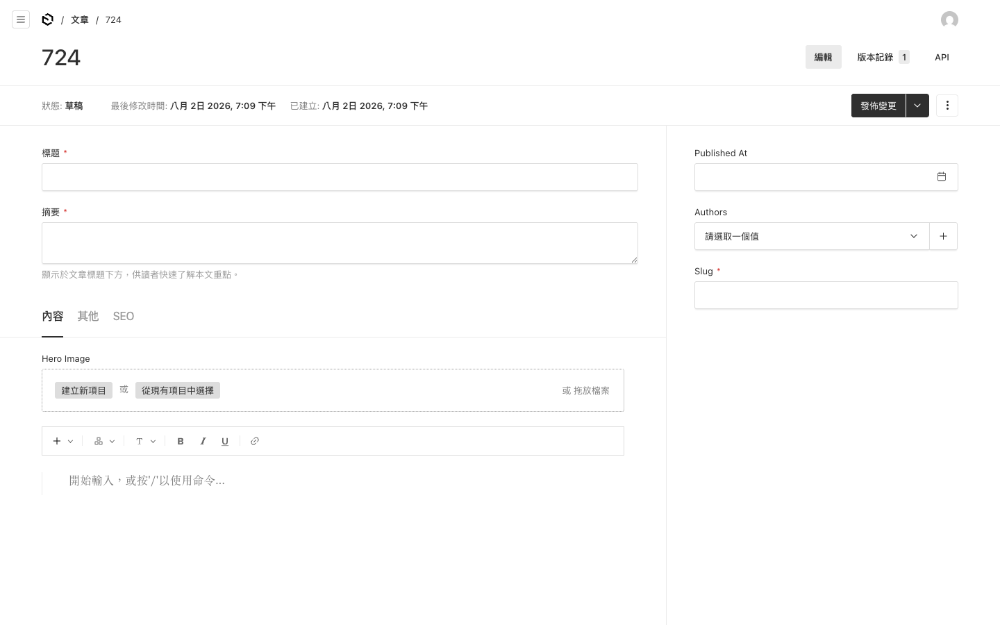

## 插入圖片

**方法一：直接在內文中插入**

1. 在編輯器中要插入的位置點一下。
2. 點工具列的 **上傳 / 媒體** 按鈕。
3. 選擇「上傳新圖片」或從媒體庫選取。
4. 填寫圖片替代文字（alt，簡述圖片內容）。

**方法二：先上傳到媒體庫**

1. 左側選 **「媒體庫」** → 上傳圖片。
2. 回到文章編輯器，用媒體按鈕插入。

媒體庫介面如圖 16 所示。詳細說明請參考[媒體庫管理](#媒體庫管理)章節。

## 插入表格

1. 在編輯器中要插入的位置點一下。
2. 點工具列的 **表格** 按鈕（或輸入 `/table`）。
3. 設定行數與列數。
4. 點選儲存格即可輸入文字。

> **注意事項**：表格功能目前為實驗性功能，若遇到異常請先以文字條列代替，並聯繫維護人員。

## 文章分類

網站共有五個主題分類：

| 分類 | 說明 |
|------|------|
| 胰臟水泡 | 囊腫、水泡相關 |
| 胰臟發炎 | 急慢性胰臟炎等 |
| 胰臟癌 | 診斷、治療、最新進展 |
| 胰臟癌篩檢 | 高風險族群、早期篩檢 |
| 胰臟健康 | 日常保健、飲食、生活型態 |

在 **「分類」** 選單可修改名稱、說明。**排序** 欄位（sortOrder）數字越小，列表中越前面。

每篇文章可勾選一個或多個分類，讀者可在 `/posts` 依分類篩選（見圖 6）。

## 常見問答（FAQ）

在文章 **「其他」** 分頁的 **FAQ** 區塊：

1. 點 **「新增項目」**。
2. 填寫 **問題** 與 **答案**。
3. 可新增多組 FAQ。
4. 發布後，FAQ 會以摺疊方式顯示在文章底部（見圖 7）。

## 行銷素材

在 **「其他」** 分頁的 **行銷素材** 區塊，可記錄：

* 封面設計備註
* YouTube 標題與描述
* Facebook / Threads 貼文文案
* 電子報摘要

這些欄位**不會顯示在公開網站**，方便整理對外宣傳用的文案。

## SEO 設定

每篇文章的 **「SEO」** 分頁可設定：

| 欄位 | 用途 |
|------|------|
| Meta 標題 | 搜尋引擎與瀏覽器分頁顯示的標題 |
| Meta 描述 | 搜尋結果摘要文字 |
| Meta 圖片 | 分享到 Facebook、Line 等時的預覽圖 |

可使用 **「產生」** 按鈕自動帶入文章標題，再視需要微調。

## 草稿、預覽與排程發布

| 狀態 | 說明 |
|------|------|
| **草稿** | 尚未公開，訪客看不到 |
| **預覽** | 編輯時可點「預覽」查看發布前效果 |
| **排程發布** | 可設定未來日期時間，到時自動發布 |
| **已發布** | 確認後才會出現在網站 `/posts` 列表 |

編輯器會每 100 毫秒自動儲存草稿，避免意外遺失內容。

# 頁面與網站設定

本節說明如何編輯固定頁面、導覽列與媒體庫。

## 編輯首頁與關於頁

1. 左側選 **「頁面」**。
2. 點選 **「首頁」** 或 **「關於」**。
3. **Hero 區塊** 分頁：修改主標、副標、按鈕連結。
4. **內容** 分頁：修改各區塊文案（引言、四大特色、精選文章等）。
5. 儲存草稿 → 預覽 → 發布。

首頁區塊編輯介面如圖 15 所示。

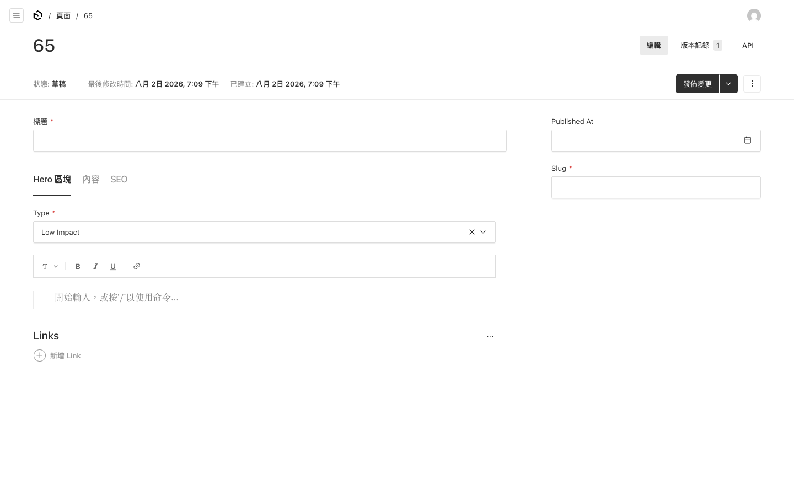

首頁共有六個可編輯內容區塊：品牌引言、四大特色、精選文章、依主題閱讀、關於章醫師、書籍推廣。

## 調整導覽列與頁尾

* **Header（導覽列）**：Globals → Header，最多 6 個連結。
* **Footer（頁尾）**：Globals → Footer，最多 4 組連結群組。

每個連結可指向站內頁面/文章，或自訂外部網址。

## 媒體庫管理

1. 左側選 **「媒體庫」**。
2. 點 **「上傳」** 新增圖片，或點選既有圖片編輯替代文字與說明。
3. 上傳的圖片可在文章編輯器或頁面區塊中引用。

媒體庫介面如圖 16 所示。

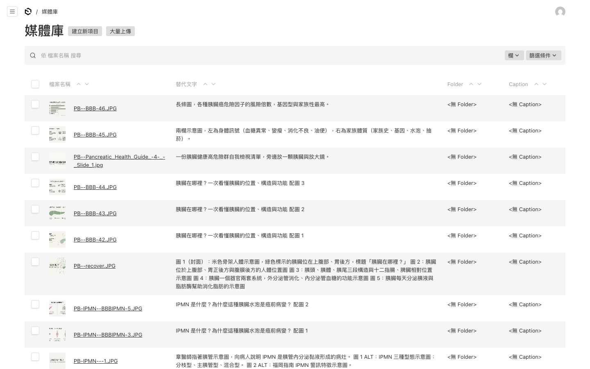

> **建議**：封面圖寬度至少 1400px；分享到社群時的預覽圖會自動裁切為 1200×630。

# 常見問題與重要提醒

## 常見問題

**Q：發布後網站沒更新？**

A：稍等 1–2 分鐘再重新整理。若仍無更新，請聯繫維護人員。

**Q：圖片裁切後前台沒變？**

A：需重新 **發布** 使用該圖片的頁面或文章。

**Q：忘記密碼？**

A：請聯繫網站維護人員重設，不要自行嘗試多次以免鎖定。

**Q：為什麼有些主題顯示「尚無文章」？**

A：該分類下尚未有 **已發布** 的文章。多數匯入文章目前仍為草稿，審核後逐一發布即可。

**Q：可以點擊「建立示範內容」按鈕嗎？**

A：請 **不要** 在正式環境點擊此按鈕，它會覆寫現有內容。

## 重要提醒

* 本網站資訊僅供 **衛教參考**，不能取代醫師面對面診斷。
* 建議重要文章在 Word 保留一份草稿備份。
* 後台網址請勿公開分享，僅限授權人員使用。

# 技術交接

本章節供維護人員或交接對象參考，包含系統架構、欄位對照與已知限制。

## 系統架構概覽

| 項目 | 說明 |
|------|------|
| 前台框架 | Next.js 16 App Router |
| 內容管理 | Payload CMS 3（繁中 UI） |
| 資料庫 | Vercel Postgres（Neon） |
| 媒體儲存 | Vercel Blob |
| 部署平台 | Vercel（網域 pancreasblog.com） |
| 分析 | Vercel Analytics |

資料流向：訪客與編輯者分別透過 Next.js 前台與 Payload Admin 存取 Postgres 資料庫；圖片檔案儲存於 Vercel Blob。

## 後台 Collection 總覽

### 編輯者可見

| Slug | 後台標籤 | 用途 |
|------|----------|------|
| `posts` | 文章 | 部落格文章 |
| `pages` | 頁面 | 首頁、關於等固定頁 |
| `categories` | 分類 | 五個主題分類 |
| `media` | 媒體庫 | 圖片上傳 |
| `users` | Users | 後台帳號 |

### 系統隱藏（不在後台顯示）

| Slug | 用途 |
|------|------|
| `redirects` | URL 重新導向（plugin 管理） |
| `forms` / `form-submissions` | 表單（Form Block 引用，後台隱藏） |
| `search` | 搜尋索引（自動同步） |
| `folders` | 媒體資料夾（隱藏） |

### Globals

| Global | 用途 |
|--------|------|
| `header` | 頂部導覽（最多 6 項） |
| `footer` | 頁尾連結群組（最多 4 組） |

> **注意**：沒有 Site Settings global。網站名稱、標語、預設 OG 圖等寫在 `src/constants/site.ts`。

## 文章 Collection 欄位

| 欄位 | 分頁 | 必填 | 說明 |
|------|------|------|------|
| `title` | 主欄 | 是 | 文章標題 |
| `excerpt` | 主欄 | 是 | 摘要，顯示於標題下方 |
| `heroImage` | 內容 | 否 | 封面圖（upload → media） |
| `content` | 內容 | 是 | Lexical 富文本（含表格、Banner、Code、MediaBlock） |
| `categories` | 其他 | 否 | 多選 relationship → categories |
| `relatedPosts` | 其他 | 否 | 多選 relationship → posts（排除自身） |
| `faq` | 其他 | 否 | Q&A 陣列 |
| `marketingNotes` | 其他 | 否 | 後台專用行銷文案群組 |
| `meta.*` | SEO | 否 | SEO plugin 欄位 |
| `publishedAt` | 側欄 | 否 | 發布日期（首次發布時自動填入） |
| `authors` | 側欄 | 否 | 多選 relationship → users |
| `slug` | 側欄 | 否 | URL 路徑，自動從標題產生 |

**版本控制**：草稿 autosave（100ms）、排程發布、最多 50 個版本。

## 頁面 Collection 與首頁 Blocks

### Hero 類型

| 類型 | 說明 |
|------|------|
| `highImpact` | 首頁使用；右側為固定品牌圖形（非 CMS 上傳） |
| `mediumImpact` | 可上傳背景圖 |
| `lowImpact` | 簡化版 |
| `none` | 無 Hero |

### 首頁 Layout Blocks

| Block | 後台名稱 | 可編輯內容 |
|-------|----------|------------|
| `quoteBlock` | Quote Block | 引言、署名、側邊說明 |
| `featuresBlock` | Features Block | 標題 + 4 個特色項目 |
| `featuredPostsBlock` | Featured Posts | 標題 + 1–3 篇精選文章 |
| `categoryNavBlock` | Category Nav | 標題 + 1–6 個分類卡片 |
| `aboutTeaserBlock` | About Teaser | 醫師簡介、學經歷、照片 |
| `bookSalesBlock` | Book Sales | 書名、描述、封面、購買連結 |
| `newsletterBlock` | Newsletter | 標題、描述（表單尚未串接） |

其他頁面還可使用：Call to Action、Content、Media Block、Form Block、Archive Block。

## 後台可改 vs 需改程式

| 項目 | 後台可改 | 需工程師 | 程式位置 |
|------|----------|----------|----------|
| 文章/頁面內容 | 是 | | |
| 導覽列/頁尾 | 是 | | Globals |
| 分類 | 是 | | |
| 媒體 | 是 | | |
| SEO 欄位 | 是 | | |
| 網站 Logo | | 是 | `src/components/Logo/` |
| Hero 品牌圖形 | | 是 | `public/elegant-pancreas.PNG` |
| 網站名稱/標語/關鍵字 | | 是 | `src/constants/site.ts` |
| 著作權/商標/醫療聲明 | | 是 | `src/content/legal.ts` |
| 服務條款頁 | | 是 | `src/app/(frontend)/terms/` |
| 電子報寄信 | | 是 | `src/blocks/NewsletterBlock/Component.tsx` |
| 整體配色/字型 | | 是 | `src/app/(frontend)/globals.css` |
| URL 重新導向 | | 是 | redirects plugin（後台隱藏） |

## 文章建立流程

1. Admin → 文章 → 建立新項目。
2. 填寫標題、摘要、正文；選填封面、分類、作者、FAQ、行銷素材。
3. 儲存草稿（autosave 每 100ms 自動執行）。
4. 準備發布時，可選擇：
   * **預覽**：Live Preview 或 Preview 按鈕（需 `PREVIEW_SECRET`）。
   * **排程**：設定 scheduled publish 日期。
   * **發布**：狀態改為 Published → `publishedAt` 自動填入 → 快取 revalidate → 搜尋索引同步。

## 帳號與權限

目前 **沒有自訂角色**。所有登入後台的使用者權限相同：

| 操作 | 條件 |
|------|------|
| 讀取已發布內容 | 公開 |
| 讀取草稿 | 需登入 |
| 新增/修改/刪除 | 需登入 |
| 進入 Admin 面板 | 需登入 Users collection |

## 環境變數

詳細部署步驟見 [DEPLOY.md](DEPLOY.md)。

| 變數 | 用途 |
|------|------|
| `POSTGRES_URL` | 資料庫連線 |
| `PAYLOAD_SECRET` | CMS 加密/Session |
| `NEXT_PUBLIC_SERVER_URL` | 正式網域（CORS、OG、連結） |
| `BLOB_READ_WRITE_TOKEN` | 媒體上傳（**正式環境必填**） |
| `PREVIEW_SECRET` | 草稿預覽驗證 |
| `CRON_SECRET` | 排程發布 cron 驗證 |
| `SEED_ADMIN_EMAIL` | Seed 建立的管理員 Email |
| `SEED_ADMIN_PASSWORD` | Seed 建立的管理員密碼 |

## 前台路由一覽

| 路由 | 說明 |
|------|------|
| `/` | 首頁（pages slug=home） |
| `/about` | 關於頁 |
| `/posts` | 文章列表（支援 `?category=`、`?q=`） |
| `/posts/page/{n}` | 分頁（每頁 12 篇） |
| `/posts/{slug}` | 單篇文章 |
| `/terms` | 服務條款/法遵頁 |
| `/admin` | 後台 |
| `/api/search` | 搜尋 API |

## 已知限制

1. **電子報訂閱**：首頁 Newsletter 區塊有 UI，但尚未串接寄信服務。
2. **29 篇草稿**：客戶文章已匯入後台，多數為草稿；正式站目前僅 1 篇已發布。
3. **「建立示範內容」**：儀表板按鈕會覆寫 seed 資料，**禁止在正式環境使用**。
4. **表格編輯器**：Lexical EXPERIMENTAL_TableFeature，若異常請改以條列代替。
5. **Forms / Redirects**：後台隱藏，需工程師透過 API 或資料庫操作。
6. **無分級權限**：所有 admin 皆可刪除任何內容。

## 截圖索引

所有截圖位於 `./delivery-screenshots/`，由 `pnpm capture:delivery-screenshots` 產生。Demo 走查時可依 [delivery-checklist.xlsx](delivery-checklist.xlsx) 的 **Demo走查Agenda** 工作表對照。

| 圖號 | 檔名 | 內容 |
|------|------|------|
| 圖 1 | `01-home-hero-desktop.png` | 首頁 Hero |
| 圖 2 | `02-home-features-desktop.png` | 四大特色 |
| 圖 3 | `03-home-categories-desktop.png` | 依主題閱讀 |
| 圖 4 | `04-home-book-desktop.png` | 書籍推廣區 |
| 圖 5 | `05-about-desktop.png` | 關於頁 |
| 圖 6 | `06-posts-list-desktop.png` | 文章列表 |
| 圖 7 | `07-post-detail-desktop.png` | 示範文章 |
| 圖 8 | `08-search-overlay-desktop.png` | 搜尋彈窗 |
| 圖 9 | `09-home-mobile.png` | 首頁手機版 |
| 圖 10 | `10-post-mobile.png` | 文章手機版 |
| 圖 11 | `11-terms-desktop.png` | 法遵頁 |
| 圖 12 | `12-admin-login.png` | 後台登入 |
| 圖 13 | `13-admin-dashboard.png` | 後台儀表板 |
| 圖 14 | `14-admin-post-edit.png` | 文章編輯 |
| 圖 15 | `15-admin-page-home.png` | 首頁區塊編輯 |
| 圖 16 | `16-admin-media.png` | 媒體庫 |

## 相關文件

| 文件 | 用途 |
|------|------|
| [delivery-checklist.xlsx](delivery-checklist.xlsx) | 交付項目、Demo Agenda、後台可編輯對照、Screenshots 索引 |
| [DEPLOY.md](DEPLOY.md) | Vercel 部署與環境變數 |
| [design/spec-home.md](design/spec-home.md) | 首頁設計規格 |
| [design/spec-legal.md](design/spec-legal.md) | 法遵文案放置規則 |

---

*如有問題，請聯繫網站維護人員。*
