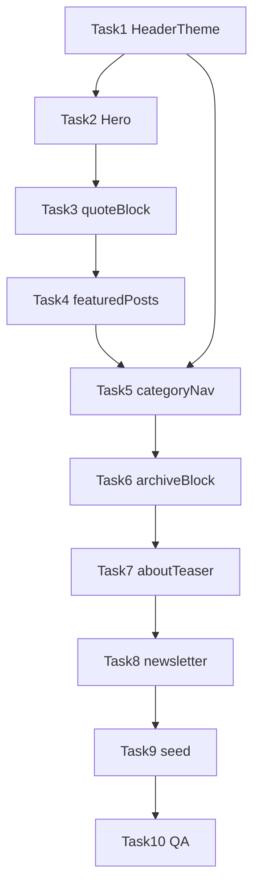

# Home Page Implementation Plan

> **For agentic workers:** REQUIRED SUB-SKILL: Use superpowers:subagent-driven-development (recommended) or superpowers:executing-plans to implement this plan task-by-task. Steps use checkbox (`- [ ]`) syntax for tracking.

**Goal:** Assemble the home page per [spec-home.md](../design/spec-home.md) — 7 Payload blocks + redesigned Hero, all using v1.1 theme components.

**Architecture:** Payload Pages collection (`slug: home`) renders `RenderHero` + `RenderBlocks`. Each new block is self-contained (`config.ts` + `Component.tsx`) and wraps itself in `Section` with the correct variant. HeaderTheme uses IntersectionObserver on inverse sections. Incremental delivery: one block per commit where possible.

**Tech Stack:** Next.js App Router, Payload CMS 3.x, Tailwind v4, existing theme components (`Section`, `ArticleCard`, etc.)

**Spec:** [docs/design/spec-home.md](../design/spec-home.md)

## Global Constraints

- Visual tokens from Integrated Design Spec v1.1 only — no home.png charcoal/gold
- Section variants: `default` / `muted` / `inverse` per spec-home §二
- Border radius: `rounded-md` (0.25rem); no card shadows
- Images: 16:9 (`aspect-video`) for article/hero media
- Metadata text: `text-brand-sage`, not `text-brand-subtitle`
- Newsletter block: UI-only in this plan (no ESP backend)
- Do not expose user-facing dark mode toggle

---

### Task 1: HeaderTheme scroll observer + page client fix

**Files:**
- Create: `src/hooks/useHeaderThemeOnScroll.ts`
- Create: `src/app/(frontend)/[slug]/page.client.tsx` refactor → `src/app/(frontend)/home-page.client.tsx` (or conditional in existing client)
- Modify: `src/app/(frontend)/[slug]/page.tsx`
- Modify: `src/heros/HighImpact/index.tsx` — add `data-header-theme="dark"` sentinel on wrapper

**Interfaces:**
- Consumes: `useHeaderTheme()` from `@/providers/HeaderTheme`
- Produces: hook that accepts `RefObject<HTMLElement>[]` sentinels; sets `'dark' | 'light'`

- [ ] **Step 1:** Remove unconditional `setHeaderTheme('light')` from `[slug]/page.client.tsx`
- [ ] **Step 2:** Implement `useHeaderThemeOnScroll(sentinelRefs)` with IntersectionObserver, `rootMargin: '-64px 0px 0px 0px'`
- [ ] **Step 3:** On home slug only, mount observer; non-home pages default to light unless hero sets dark
- [ ] **Step 4:** Verify: Hero visible → header light text; scroll to middle → dark text
- [ ] **Step 5:** Commit: `fix(theme): scroll-aware HeaderTheme for home page`

---

### Task 2: Hero redesign (highImpact)

**Files:**
- Modify: `src/heros/HighImpact/index.tsx`
- Modify: `src/app/(frontend)/[slug]/page.tsx` — remove extra top padding on home

**Interfaces:**
- Consumes: `Section`, `DisplayHeading`, `BodyText`, `ReadMoreLink`, `Media`
- Produces: two-column inverse hero matching spec-home §3.2

- [ ] **Step 1:** Replace black overlay div with `Section variant="inverse" spacing="lg"`
- [ ] **Step 2:** Implement `grid lg:grid-cols-2` layout — left richText, right media/placeholder
- [ ] **Step 3:** Map hero links to CTA / ReadMoreLink
- [ ] **Step 4:** Add `data-header-theme="dark"` attribute for Task 1 observer
- [ ] **Step 5:** Visual check at `/` with seeded home hero
- [ ] **Step 6:** Commit: `feat(home): redesign highImpact hero to v1.1 inverse layout`

---

### Task 3: quoteBlock

**Files:**
- Create: `src/blocks/QuoteBlock/config.ts`
- Create: `src/blocks/QuoteBlock/Component.tsx`
- Modify: `src/blocks/RenderBlocks.tsx`
- Modify: `src/collections/Pages/index.ts`
- Modify: `src/payload.config.ts` (if blocks registered there)

**Interfaces:**
- Consumes: `QuoteBlock`, `BodyText`, `Section`, RichText for sideText
- Produces: block slug `quoteBlock`, fields: quote, attribution, sideText

- [ ] **Step 1:** Add Payload block config per spec-home §3.3
- [ ] **Step 2:** Component: `Section muted`, 2-col grid, return null if quote empty
- [ ] **Step 3:** Register in RenderBlocks + Pages layout blocks
- [ ] **Step 4:** Run `pnpm generate:types`
- [ ] **Step 5:** Commit: `feat(blocks): add quoteBlock for home quote section`

---

### Task 4: featuredPostsBlock

**Files:**
- Create: `src/blocks/FeaturedPostsBlock/config.ts`
- Create: `src/blocks/FeaturedPostsBlock/Component.tsx`
- Modify: `src/blocks/RenderBlocks.tsx`, `src/collections/Pages/index.ts`

- [ ] **Step 1:** Config: sectionNumber, heading, posts relationship (max 2)
- [ ] **Step 2:** Component: SectionNumber + SectionHeading header row, 2-col ArticleCard grid
- [ ] **Step 3:** First card optional inverse styling (border/background per spec)
- [ ] **Step 4:** Register + generate types
- [ ] **Step 5:** Commit: `feat(blocks): add featuredPostsBlock`

---

### Task 5: categoryNavBlock

**Files:**
- Create: `src/blocks/CategoryNavBlock/config.ts`
- Create: `src/blocks/CategoryNavBlock/Component.tsx`
- Modify: `src/blocks/RenderBlocks.tsx`, `src/collections/Pages/index.ts`

- [ ] **Step 1:** Config: sectionNumber, heading, items[] (number, title, link) max 4
- [ ] **Step 2:** Component: `Section inverse`, 4-col grid of linked cards with Lucide arrow
- [ ] **Step 3:** Add `data-header-theme="dark"` for scroll observer
- [ ] **Step 4:** Register + generate types
- [ ] **Step 5:** Commit: `feat(blocks): add categoryNavBlock for questions section`

---

### Task 6: archiveBlock redesign

**Files:**
- Modify: `src/blocks/ArchiveBlock/Component.tsx`
- Modify: `src/components/LatestArticlesSection/index.tsx` (if still used — migrate to ArticleCard or deprecate)

- [ ] **Step 1:** Wrap in `Section variant="default"`
- [ ] **Step 2:** Replace legacy `Card` with `ArticleCard`
- [ ] **Step 3:** Grid: `lg:grid-cols-3`, add footer `ReadMoreLink href="/posts"`
- [ ] **Step 4:** Commit: `refactor(blocks): archiveBlock uses v1.1 ArticleCard and Section`

---

### Task 7: aboutTeaserBlock

**Files:**
- Create: `src/blocks/AboutTeaserBlock/config.ts`
- Create: `src/blocks/AboutTeaserBlock/Component.tsx`
- Modify: `src/blocks/RenderBlocks.tsx`, `src/collections/Pages/index.ts`

- [ ] **Step 1:** Config: heading, body richText, image, link
- [ ] **Step 2:** Component: 2-col grid, image left, text + ReadMoreLink right
- [ ] **Step 3:** Register + generate types
- [ ] **Step 4:** Commit: `feat(blocks): add aboutTeaserBlock`

---

### Task 8: newsletterBlock

**Files:**
- Create: `src/blocks/NewsletterBlock/config.ts`
- Create: `src/blocks/NewsletterBlock/Component.tsx`
- Modify: `src/blocks/RenderBlocks.tsx`, `src/collections/Pages/index.ts`

- [ ] **Step 1:** Config: heading, description
- [ ] **Step 2:** Component: `Section muted`, centered, `NewsletterForm` with placeholder onSubmit
- [ ] **Step 3:** Register + generate types
- [ ] **Step 4:** Commit: `feat(blocks): add newsletterBlock (UI-only)`

---

### Task 9: RenderBlocks cleanup + home seed

**Files:**
- Modify: `src/blocks/RenderBlocks.tsx` — remove `my-16` wrapper
- Modify: `src/endpoints/seed/home.ts` — full layout per spec-home §八
- Modify: `src/app/(frontend)/[slug]/page.tsx` — home padding fix

- [ ] **Step 1:** Remove generic spacing from RenderBlocks
- [ ] **Step 2:** Rewrite home seed with 6 blocks in spec order + updated hero copy
- [ ] **Step 3:** Run seed locally, verify `/` renders all sections
- [ ] **Step 4:** Commit: `feat(home): update seed and RenderBlocks for v1.1 layout`

---

### Task 10: Visual QA + spec-home checklist

**Files:**
- Modify: `docs/design/spec-home.md` — update status Draft → Implemented (after QA)

- [ ] **Step 1:** Walk spec-home §九 verification checklist on desktop + mobile 375px
- [ ] **Step 2:** Confirm HeaderTheme at Hero, middle, Questions, Footer scroll positions
- [ ] **Step 3:** Run `pnpm exec tsc --noEmit`
- [ ] **Step 4:** Update spec-home status if all checks pass
- [ ] **Step 5:** Commit: `docs(home): mark spec-home verification complete`

---

## Dependency Graph

Tasks 3–8 can be parallelized after Task 2 if using subagents; Task 9 requires all blocks registered.
